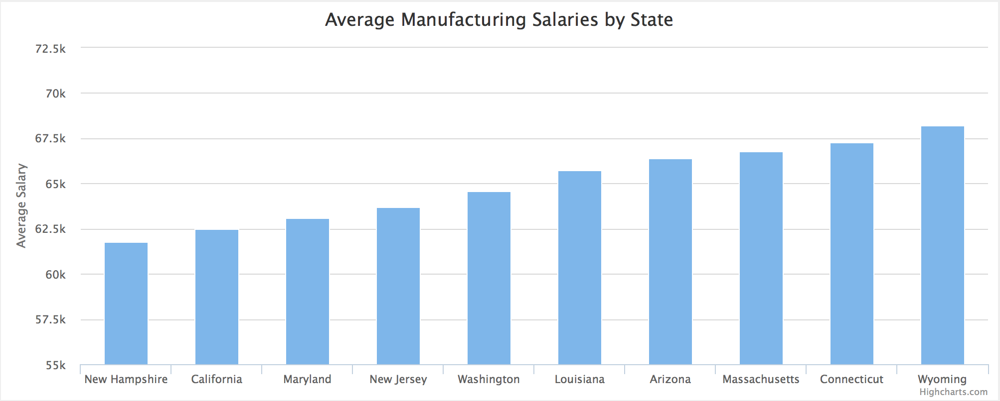
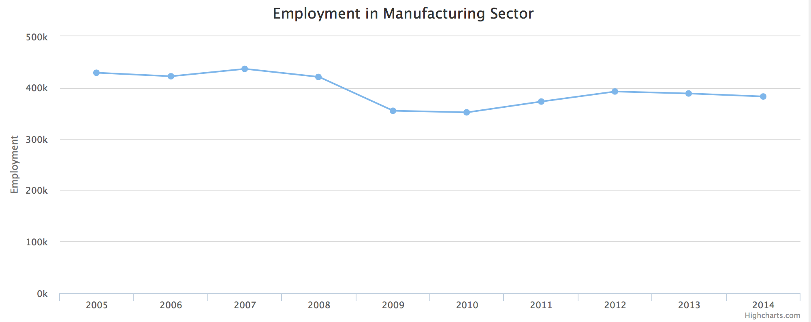

# Charting With API Data

## Learning Objectives

* Review basics techniques for fetching data using AJAX
* Use underscore.js to sort, filter and prepare data for presentation
* Present data using line and bar charts via highcharts.js
* Organize JS code into multiple files for reusability

## Framing

Our goal today to begin is to build two charts using the [Annual Survey of Manufacturers API](https://www.census.gov/data/developers/data-sets/Annual-Survey-of-Manufactures.html)

* A bar chart of the 10 ten states by average salary in the manufacturing sector
* A line graph showing change in manufacturing employment over time (by sub-sector)




To do that, we're going to have to put all the pieces we've learned together,
and learn one more tool (underscore.js) to more easily sort and manipulate our
data.

## Turn and Talk: How Do We Build These?

Take 7 minutes (the first 2 by yourself), and try to list out in as much detail
as you can, all the steps (pseudocode would be fine) to build one or both of
these charts.

## Sorted Bar Chart of Average Salaries by State

### Exercise: Getting Started - Building the HTML and JS

Create a new project folder and ensure you have the following:

* An HTML page with a header for our site, and placeholder divs for our two
charts. They should have ids of: `employment-by-category` and `average-salaries`
  * It should link to a CSS file
  * It should load jQuery, Highcharts, Underscore.js, and a local script file
* In your CSS file, just put one or a few rules to verify it's working
* In your JS file, copy over the [code we built yesterday morning](https://github.com/ga-dc/DOC_immersive/blob/master/demos/asm_manual_bar_graph/js/script.js#L1)

Take a few minutes to re-read over this code and what it's doing.

### Exercise: What's Left to Do?

Based on our experiences yesterday... what's still left to do to get this into
a sorted bar chart?

Think about how the data needs to be formatted for high-charts to work, and what
data we may need to calculate.

### Exercise: Write a function to calculate average salary

Write a function `calculateAverageSalary` which takes the results formatted as
objects:

```js
[
  {
    EMP: "234726"
    GEO_TTL: "Alabama"
    PAYANN: "11759599"
    YEAR: "2014"
    state: "1"
  },
  {
    EMP: "12933"
    GEO_TTL: "Alaska"
    PAYANN: "552105"
    YEAR: "2014"
    state: "2"
  }
]
```

and updates them to include average salary:

```js
[
  {
    EMP: 234726
    GEO_TTL: "Alabama"
    PAYANN: 11759599
    YEAR: "2014"
    averageSalary: 50099
  },
  {
    EMP: 12933
    GEO_TTL: "Alaska"
    PAYANN: 552105
    YEAR: 2014
    averageSalary: 42689
  }
]
```

Update your ajax code to use another `then` method which uses our new
`calculateAverageSalary` function, and then logs the results.

### Underscore.js - A Swiss-Army Knife for JS

Underscore.js is a great library that adds some nice functionality to JS.

Take 6 minutes to skim through [the documentation](http://underscorejs.org) and
look for functionality that may help us in our quest to build awesome charts.

Try to read and understand the code examples for methods that look interesting.

Here are some suggestions:

- `each`
- `map`
- `sortBy`
- `pluck`
- `min`
- `max`
- `select` / `reject`
- `object`

----

#### Useful Underscore Methods

- `each`
  - a convenient way to perform a function using each item in an array
- `sortBy`
  - sort an array of objects by a property of each object
- `map`
  - converts an array into a new array using a function
- `pluck`
  - converts an array of objects into a new array by plucking a property value from each object
- `min` / `max`
  - find the min / max number of an array
- `select` / `reject`
  - find the elements in an array for which the 'test' function returns true
- `object`
  - convert two arrays into an object using the first array as the keys, and the second as values

### Putting It Together

Now it's time to use what we've learned to build the graph.

#### Exercise: Basic Graph

Using our examples from yesterday, build a function that graphs the salary data.

Remember that highcharts is expecting two arrays:

- for the x-axis, an array of state names
- for the y-axis, an array of average salaries

Use `_.pluck` to generate these two arrays.

#### Exercise: Sorting and Slicing

Use `_.sortBy` to sort the array by average salary, and `slice` to only pick the
top ten states. You may need to `reverse` the array to get it in the right order.


## Lab

Using the ASM API's endpoint for time-series data to build a line graph showing
employment in manufacturing over time.

* x-axis: years
* y-axis: employment

[URL for this request](http://api.census.gov/data/timeseries/asm/industry?get=NAICS_TTL,EMP,GEO_TTL&for=us:*&YEAR=2005,2006,2007,2008,2009,2010,2011,2012,2013,2014&NAICS=331&key=81cdc733d3ac0f3496a88eebbed0a31478c403c6)
